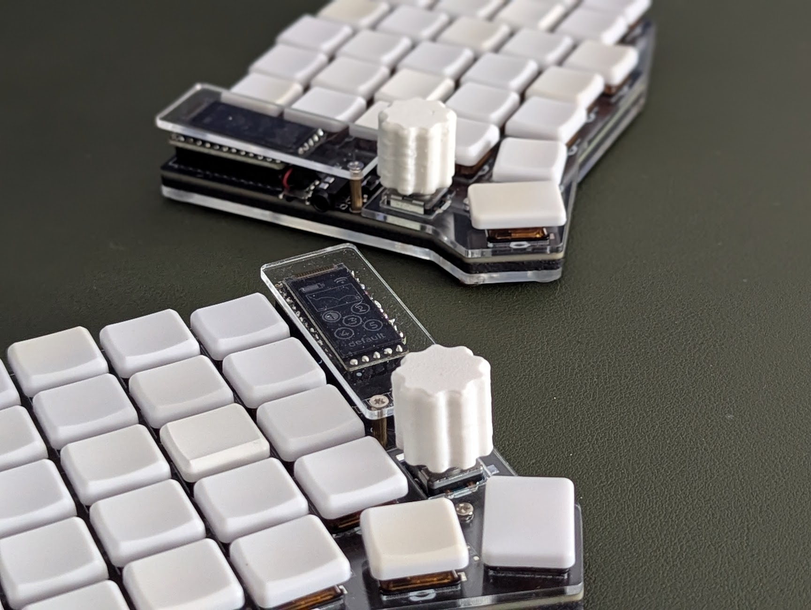
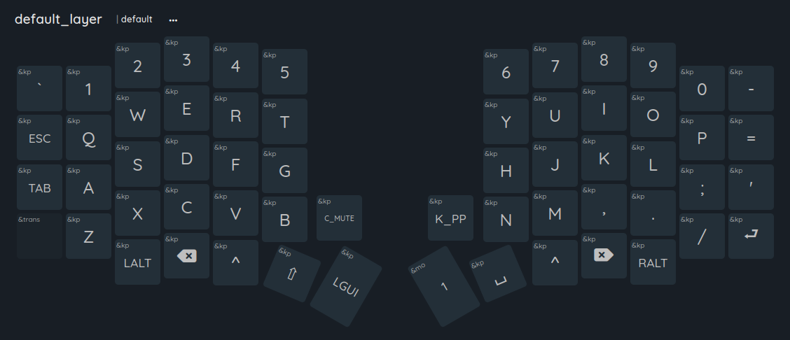
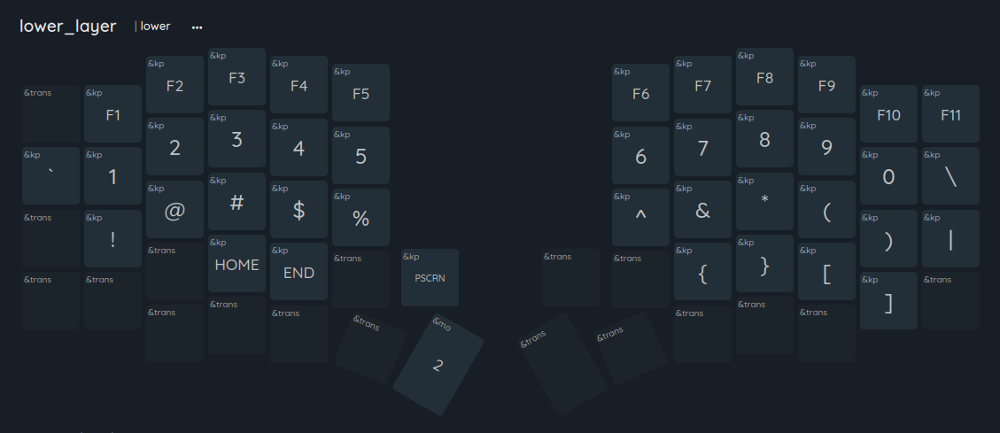
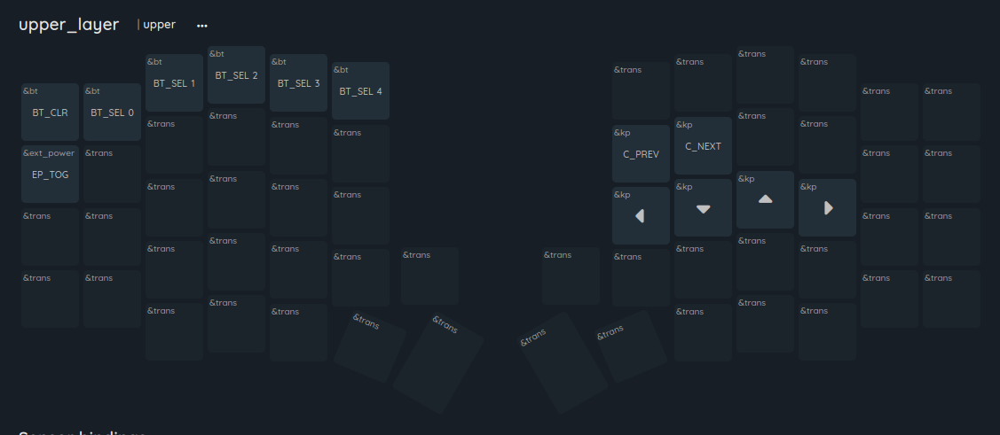

# zmk-config-sofle-choc-v3

Shield config & firmware for my Sofle Choc. Built for maintaining a low profile. Keymap layout with a focus on programming & gaming.

## Hardware

- [Sofle Choc v3.5](https://github.com/josefadamcik/SofleKeyboard), original by [Josef Adamčík](https://github.com/josefadamcik/SofleKeyboard)
- [nice!nano](https://nicekeyboards.com/nice-nano/) low-power, bluetooth-capable board
- [nice!view](https://nicekeyboards.com/nice-view) low-power OLED
- Kailh Choc Sunset tactile switches
- 110 mAh LiPo battery for each side (hidden neatly under the controller)
- EC11 rotary encoders for scrolling & media control

## Keymap

